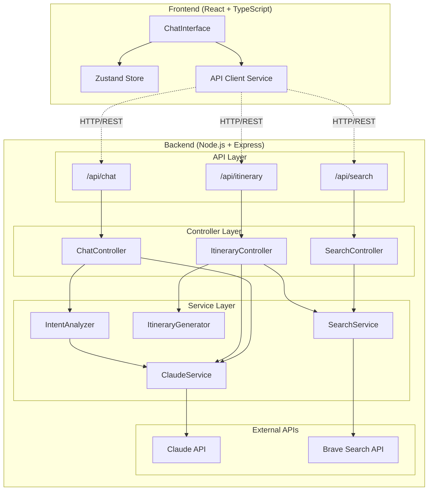
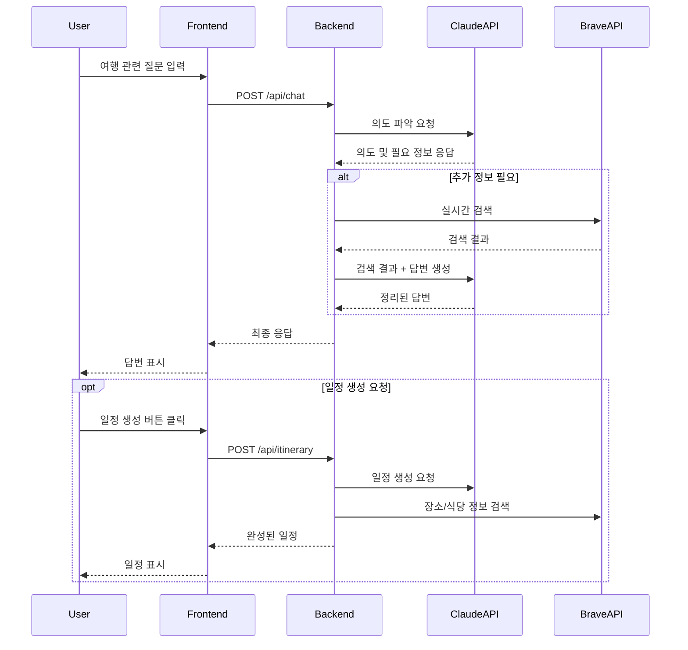

# Travel AI Service - 상세 아키텍처

## 시스템 아키텍처 다이어그램



## 데이터 흐름 다이어그램



## 컴포넌트 상세 설계

### 1. Frontend Components

```
frontend/src/
├── components/
│   ├── Chat/
│   │   ├── ChatInterface.tsx      # 메인 채팅 UI
│   │   ├── MessageBubble.tsx      # 메시지 표시
│   │   ├── InputBox.tsx           # 입력 컴포넌트
│   │   └── QuickActions.tsx       # 빠른 액션 버튼
│   ├── Itinerary/
│   │   ├── ItineraryView.tsx      # 일정 표시
│   │   ├── DaySchedule.tsx        # 일별 스케줄
│   │   └── ActivityCard.tsx       # 활동 카드
│   └── Search/
│       ├── SearchResults.tsx      # 검색 결과
│       └── PlaceCard.tsx          # 장소 정보 카드
```

### 2. Backend Services

```
backend/src/
├── services/
│   ├── claude/
│   │   ├── ClaudeService.ts       # Claude API 통합
│   │   ├── IntentAnalyzer.ts      # 사용자 의도 분석
│   │   └── PromptTemplates.ts     # AI 프롬프트 관리
│   ├── search/
│   │   ├── SearchService.ts       # Brave API 통합
│   │   └── SearchResultParser.ts  # 검색 결과 파싱
│   └── itinerary/
│       ├── ItineraryGenerator.ts  # 일정 생성 로직
│       └── BudgetCalculator.ts    # 예산 계산
```

## API 엔드포인트 상세

### POST /api/chat
**목적**: 사용자와의 대화 처리
- 의도 파악 (여행지 추천, 정보 질문, 일정 생성 등)
- 필요시 실시간 검색
- 컨텍스트 기반 응답 생성

### POST /api/search
**목적**: 실시간 여행 정보 검색
- 장소, 식당, 활동 검색
- 가격 정보 조회
- 리뷰 및 평점 수집

### POST /api/itinerary
**목적**: 맞춤형 여행 일정 생성
- 일정 최적화
- 예산 분배
- 시간대별 활동 배치